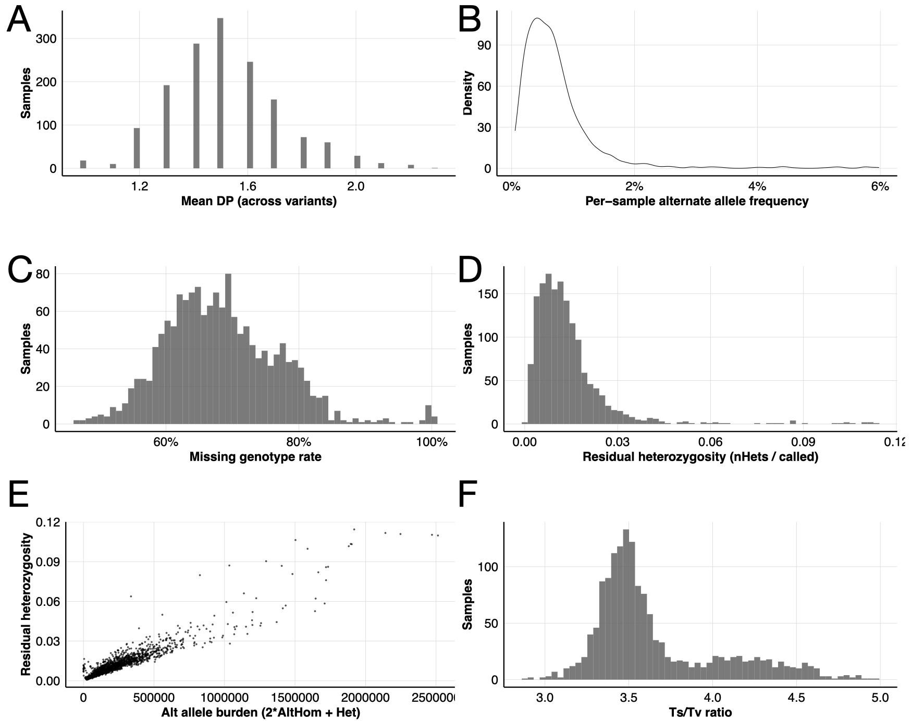
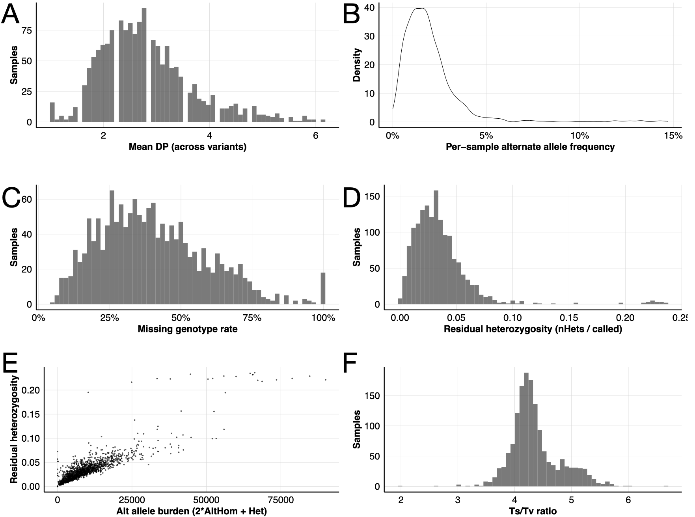
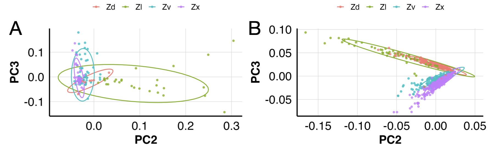

# BZea Analysis

This repository documents the end-to-end processing for **low-pass sequencing** data, starting from raw paired-end FASTQ files and proceeding through a reproducible genotype + ancestry + association workflow.

## BZea Breeding Scheme:

B73 was crossed with teosinte lines for 2 backcrosses and 3 selfs. (Need more details here)

## Expected genotype proportions after BC2 + 3 selfing generations (per locus)

This section gives the **expected fraction of genotypes** at any SNP where the recurrent parent (B73) and the donor (teosinte) carry different alleles, assuming:
- B73 is homozygous **BB**
- the teosinte donor is homozygous **TT**
- random mating, no segregation distortion, no selection, and perfect marker informativeness.

This expectation applies **separately within each donor family** you used:
- **Zd** = *Zea diploperennis* (donor allele = T)
- **Zl** = *Zea luxurians* (donor allele = T)
- **Zx** = *Zea mexicana* (donor allele = T)
- **Zv** = *Zea parviglumis* (donor allele = T)

> Important: the only thing that changes across Zd/Zl/Zx/Zv is which teosinte allele is present and how divergent it is from B73. The Mendelian expectations below are the same for all families.

---

### Breeding scheme
B73 (BB) × Teo (TT) → **F1 = 100% BT**

Then:
- **BC1 = F1 × BB**
- **BC2 = BC1 × BB**
- then **three selfing generations**: S1 → S2 → S3

---

### Step 1 — After two backcrosses (BC2)

At an informative locus:

**BC1 (BT × BB):**
- 1/2 BB
- 1/2 BT

**BC2 (BC1 × BB):**
- P(BB) = 3/4
- P(BT) = 1/4
- P(TT) = 0

So at BC2:
- **BB = 0.75**
- **BT = 0.25**
- **TT = 0.00**

This also matches the ancestry expectation: teosinte allele fraction is **12.5%** at BC2 (because BT loci carry one donor allele copy).

---

### Step 2 — Effect of selfing: how heterozygosity decays

If you self a heterozygote **BT** for *s* generations, heterozygosity halves each generation:

- **P(BT after s selfs) = (1/2)^s**
- The remaining probability becomes homozygous, split equally:
  - **P(BB) = (1 − (1/2)^s)/2**
  - **P(TT) = (1 − (1/2)^s)/2**

For **s = 3** (three selfs), starting from BT:
- BT = (1/2)^3 = **1/8 = 0.125**
- BB = TT = (1 − 1/8)/2 = **7/16 = 0.4375**

---

### Step 3 — Final genotype proportions after BC2 + 3 selfs

At BC2, only **25%** of loci are heterozygous (BT). The other **75%** are already BB and remain BB through selfing.

So final expectations:

- **P(BB) = 0.75 + 0.25×0.4375 = 0.859375 = 85.94%**
- **P(BT) = 0.25×0.125 = 0.03125 = 3.13%**
- **P(TT) = 0.25×0.4375 = 0.109375 = 10.94%**

✅ **Genome-wide at informative loci (BC2 → S3):**
- **~85.94% homozygous B73 (BB)**
- **~3.13% heterozygous (BT)**
- **~10.94% homozygous teosinte (TT)**

A key sanity check:
- The **teosinte allele fraction stays 12.5%** overall (expected for BC2), but selfing shifts donor ancestry from **heterozygous → homozygous**.

---

## “Out of the teosinte introgression, how much is het vs homo teosinte?”

There are two common ways to report this:

### A) Among loci that carry *any* teosinte allele (BT or TT)
Fraction of loci with donor present:
- BT + TT = 3.13% + 10.94% = **14.06%**

Within those “introgressed loci”:
- Het share = 3.13 / 14.06 = **22.22%**
- Homo-teo share = 10.94 / 14.06 = **77.78%**

### B) Among teosinte **allele copies** (the 12.5%)
Count donor allele copies:
- BT contributes **1** donor copy per locus (at 3.13% loci)
- TT contributes **2** donor copies per locus (at 10.94% loci)

Donor allele copies:
- From BT: 0.03125 × 1 = 0.03125
- From TT: 0.109375 × 2 = 0.21875
Total donor allele copies = 0.25 (which corresponds to **12.5%** of all allele copies)

So the donor allele copies are:
- **12.5% of donor alleles are in heterozygotes (BT)**
- **87.5% of donor alleles are in homozygous TT**

---

### Practical implication for low-pass genotyping
With low-pass depth, **heterozygotes are harder to call confidently**, and the expected heterozygote fraction after BC2+S3 is small (~3.1% of loci). Most donor ancestry is expected to appear as **homozygous TT** at loci where donor segments are fixed within a line, which is why imputation / probabilistic ancestry methods are helpful when coverage is low.
## Genotyping

### 1) Demultiplexing by barcode (sabre)
- Split pooled FASTQs into per-sample FASTQs using barcode/index definitions using `sabre`.
- Outputs: `sample_R1.fastq.gz`, `sample_R2.fastq.gz` (+ reports/logs)

### 2) Adapter/primer trimming + quality filtering (Trimmomatic)
- Remove adapter/primer contamination and low-quality bases.
- Outputs: trimmed paired FASTQs (+ unpaired reads, trimming logs)

### 3) Alignment + BAM processing (required before GL calling)
- Align to the **B73 reference** (e.g., B73 Ref v5) using `bwa mem`.
- Post-processing:
  - sort BAM
  - mark duplicates
  - index BAM
  - basic QC (mapping %, coverage summaries)
- Outputs: `sample.sorted.markdup.bam` + `.bai` (+ QC summaries)

### 4) Genotype likelihood generation + genotype calling (bcftools mpileup/call)
- Generate genotype likelihoods from low-pass BAMs (`bcftools mpileup`).
- Joint genotype calling across samples (`bcftools call`) to produce cohort VCF/BCF.
-  Filtering and normalization:
  - variant-level filters (DP, QUAL, missingness)
  - biallelic SNP selection
- Outputs: cohort VCF/BCF (raw + filtered)

### 5) Imputation
- Impute missing genotypes using `Beagle`.
- Outputs: imputed VCF + quality tables

---

## Introgression analysis (RTIGER)

We infer **local ancestry states** along the genome for each line (B73 vs teosinte ancestry) using **RTIGER** R package, leveraging low-pass information through allele counts / genotype likelihood–compatible inputs.

**Inputs**
- Per-sample allele-count

**Outputs**
- Posterior probabilities per marker per sample:
  - `gamma` matrices (state posterior; typically 2-state or 3-state, e.g. B73 / HET / TEO)
- Segment-level introgression summaries:
  - introgression boundaries, lengths

---

## QTL / association mapping

We perform genome scans using **GridLMM** with **LOCO (leave-one-chromosome-out) kinship** to control relatedness while preserving power on the tested chromosome.

### 6) Kinship matrix construction (PLINK2 LOCO)
- Build pruned marker set (LD pruning) for stable kinship estimation.
- Compute LOCO relationship matrices per chromosome.
- Outputs (per chromosome):
  - `LOCO_chrN.rel` + `LOCO_chrN.rel.id`

### 7) GridLMM GWAS / QTL scans
We developed multiple predictor modes:

**A) SNP GWAS (standard)**
- Uses SNP dosages (from VCF/PLINK/Beagle export) with LOCO K.

**B) RTIGER dosage GWAS (ancestry dosage model)**
- Predictor: expected teosinte allele dosage derived from RTIGER posteriors.
- Tests whether teosinte ancestry dosage at each bin/marker associates with phenotype.
- NOTE: this looked pretty similar to (C) so did not do more of this. 

**C) RTIGER state-probability GWAS (multi-df ancestry model)**
- Predictor: state probabilities (e.g., B73 vs HET/TEO probability predictors).

**Outputs**
- Per-chromosome results tables with p-values, effect estimates, model diagnostics

---

## Software and packages

### Genotyping

- **sabre** — demultiplexing by barcode (FASTQ splitting)
- **Trimmomatic** — adapter/primer trimming + quality filtering
- **bwa-mem2** *(recommended)* or **bwa** — read alignment to reference genome
- **samtools** — BAM/SAM manipulation (sort, index, stats, depth)
- **picard** — duplicate marking
- **bcftools** — genotype likelihoods + variant calling + querying
- **vcftools**  — quick VCF filters / summaries
- **bgzip / tabix** *(htslib)* — compress + index VCF/BCF outputs


### Imputation and Variant handling

- **plink2** — variant QC, LD pruning, PCA, relationship matrices, LOCO kinship (`.rel/.rel.id`)
- **Beagle** (Java) — genotype imputation

### Introgression inference (RTIGER)

- **R** (>= 4.1 recommended)
- **RTIGER** R package (+ its dependencies)
- **Julia** (1.0.5 recommended)

### QTL / association mapping

- **R**
- **GridLMM** R package
- **plink2** *(for LOCO kinship files)*:

### Gene annotation resources

- **GFF3 annotation** for the reference build (we used v5 annotation - `Zm-B73-REFERENCE-NAM-5.0_Zm00001eb.1.gff3`)

---

## Step 1 — Demultiplex pooled FASTQs

**Goal:** Split pooled lane-level paired-end FASTQs into per-sample FASTQs using a barcode map.

### Inputs
- Pooled lane FASTQs:
  - `..._R1_001.fastq.gz`
  - `..._R2_001.fastq.gz`
- Barcode map file (`.txt`)

### Barcode file format
Tab-separated **2 columns**:

1. **BARCODE** (exact barcode sequence)
2. **OUTPUT_PREFIX** (sample name)

Example:

```txt
ACGTACGT    Sample_001
TGCATGCA    Sample_002
GATCTAGA    Sample_003
```

Unmatched reads are written to the `no_bc_match_*` files.

### Outputs
- Per-sample paired FASTQs written by sabre (based on column 2 of the barcode file)
- Unmatched reads:
  - `no_bc_match_S<...>_R1.fq.gz`
  - `no_bc_match_S<...>_R2.fq.gz`

### Run
```bash
bsub < scripts/01_demultiplex_sabre.tcsh
```

📜 Script: [`scripts/01_demultiplex_sabre.sh`](scripts/01_demultiplex_sabre.sh)

---

## Step 2 — Trim adapters/primers + quality filter (Trimmomatic PE)

**Goal:** Remove adapters/primers 

### Inputs
- Demultiplexed paired FASTQs:
  - `*_R1.fq.gz`
  - `*_R2.fq.gz`

### Outputs
- Paired reads (used for alignment):
  - `*_paired_R1.fq.gz`
  - `*_paired_R2.fq.gz`

### Parameters used
- `ILLUMINACLIP:<adapters.fa>:2:30:10`
- `LEADING:3`
- `TRAILING:3`
- `SLIDINGWINDOW:4:15`
- `MINLEN:36`


### Run
```bash
bsub < scripts/02_trim_trimmomatic.tcsh
```

📜 Script: [`scripts/02_trim_trimmomatic.sh`](scripts/02_trim_trimmomatic.sh)  

---

## Step 3 — BAM preprocessing (sort → mark/remove duplicates → index)

**Goal:** Ensure each sample BAM is **coordinate-sorted**, **deduplicated**, and **indexed** before genotype likelihood (GL) generation with `bcftools mpileup`.

Ensure the files are:
- sorted 
- Mark/remove duplicates
- Index BAMs files

### Inputs
- Aligned BAMs (usually from BWA/BWA-MEM2), one per sample:
  - `PN*_SID*.bam`

### Outputs
For each input `PN*_SID*.bam`
- Sorted BAM: `PN*_SID*.sorted.bam`
- Deduplicated BAM (duplicates removed): `PN*_SID*.sorted.rmdup.bam`
- Metrics: `PN*_SID*.dedup_metrics.txt`
- Index: `PN*_SID*.sorted.rmdup.bam.bai`

### Run
```bash
bash scripts/03_bam_sort_dedup_index.sh
```

📜 Script: [`scripts/03_bam_sort_dedup_index.sh`](scripts/03_bam_sort_dedup_index.sh)  

---

## Step 4 — Genotype likelihoods (GL) genotyping at SNPVersity sites (bcftools)

**Goal:** Generate genotype likelihood–based calls **only at known SNP sites** using SNPVersity, by running `bcftools mpileup | bcftools call` in parallel across **chromosomes × BAM-chunks**, then merging outputs.

### What you need before running Step 4
- Reference FASTA + index:  
  - `Zm-B73-REFERENCE-NAM-5.0.fa`  
  - `Zm-B73-REFERENCE-NAM-5.0.fa.fai`  (create with `samtools faidx ref.fa`)
- SNPVersity per-chromosome VCFs (indexed):  
  - `chr1_high_coverage.vcf.gz` … `chr10_high_coverage.vcf.gz` (+ `.tbi`)
- BAMs are **sorted + (deduped recommended) + indexed** (`.bai`)

---

### 4.1 Build SNPVersity allele-target files (biallelic SNPs only)

**Goal:** Convert each SNPVersity VCF into a **tabix-indexed target file** that contains:  
`CHROM  POS  REF,ALT`

**Outputs (per chromosome):**
- `SNPversity/targets_als/chrN.als.tsv.gz`
- `SNPversity/targets_als/chrN.als.tsv.gz.tbi`

**Run**
```bash
bsub < 04_SNPVersity_bialleles.sh
```
📜 Script: `04_SNPVersity_bialleles.sh`

---

### 4.2 Create BAM list (absolute paths)

**Goal:** Generate a sorted list of all BAMs used for genotyping.

**Output:**
- `GL_work/bamlist.txt`

**Run:**
```bash
bsub < 05_BAM_list.sh
```
📜 Script: `05_BAM_list.sh`

---

### 4.3 Split BAM list into chunks (controls open file handles)

**Goal:** Split BAM list into manageable chunks (you used `CHUNK=100`) so each mpileup job opens fewer BAMs.

**Outputs:**
- `GL_work/bam_chunks/bamlist.chunk.000`
- `GL_work/bam_chunks/bamlist.chunk.001`
- `...`

**Run:**
```bash
bsub < 05_create_chunks.sh
```
📜 Script: `05_create_chunks.sh`

---

### 4.4 Compute GL-based calls per (chromosome × BAM-chunk)

**Goal:** For each chromosome and BAM chunk:
- run `bcftools mpileup` restricted to:
  - chromosome: `-r chrN`
  - target sites: `-T chrN.als.tsv.gz`
- then call genotypes with `bcftools call` using `-C alleles` to force SNPVersity alleles

**Outputs:**
- `GL_work/GL_by_chr_chunks/chrN.chunk###.bcf`
- `GL_work/GL_by_chr_chunks/chrN.chunk###.bcf.csi`

**Run**
```bash
bsub < 06_GL.sh
```
📜 Script: `06_GL.sh`

---

### 4.5 Merge chunk-BCFs into one BCF per chromosome

**Goal:** Each `chrN.chunk###.bcf` contains a **subset of samples**. This step merges all chunk outputs into a single multi-sample chromosome BCF.

**Outputs (per chromosome):**
- `GL_work/GL_by_chr_merged/chrN.merged_withGT.bcf`
- `GL_work/GL_by_chr_merged/chrN.merged_withGT.bcf.csi`

**Run:**
```bash
bsub < 07_combine_bcf.sh
```
📜 Script: `07_combine_bcf.sh`

---

### 4.6 Concatenate chr1–chr10 into one genome-wide BCF

**Goal:** Concatenate chromosome BCFs into a single file.

**Outputs:**
- `GL_work/final_genotypes/BZea.chr1_10.bcf`
- `GL_work/final_genotypes/BZea.chr1_10.bcf.csi`

**Run:**
```bash
bsub < 08_merge_one_chr.sh
```
📜 Script: `08_merge_one_chr.sh`

---

## Results

### Unfiltered genotype QC summary



**Figure 1 | Sample-level genotype statistics for the unfiltered post-calling dataset.**  
(A) Distribution of mean read depth (DP) per sample averaged across variant sites.  
(B) Density of per-sample alternate allele frequency (fraction of called alleles that are non-reference).  
(C) Distribution of per-sample missing genotype rate.  
(D) Distribution of residual heterozygosity per sample, calculated as nHets / nCalled.  
(E) Relationship between residual heterozygosity and alternate allele burden (2×AltHom + Het), computed across called sites.  
(F) Distribution of per-sample transition/transversion (Ts/Tv) ratio.  
This panel set reflects raw calls prior to downstream QC filters; outliers in missingness, heterozygosity, ALT burden, or Ts/Tv flag samples for exclusion or closer inspection. Known controls/checks (e.g., B73 and repeated check lines) may occupy distribution extremes due to reference similarity and/or coverage differences and are assessed separately from the primary study panel.


Figure 1 summarizes per-sample QC metrics for the *unfiltered* genotype calls (immediately after variant calling, prior to any sample- or site-level filtering) and highlights the expected properties of a raw low-pass dataset along with a small set of clear outliers. Mean depth per sample is narrowly centered around ~1.4–1.7× (Panel A), consistent with uniformly low sequencing depth across the cohort at this stage. The per-sample alternate allele fraction is strongly concentrated at low values with a right-skewed tail (Panel B), indicating that most individuals contribute relatively few non-reference calls while a minority of samples show elevated ALT fractions that merit follow-up (e.g., higher divergence from the reference, contamination/mixture, or mapping artifacts). Missing genotype rate is high and broadly distributed (Panel C), with most samples in the ~60–80% missing range and a tail approaching complete missingness for a subset of individuals, consistent with incomplete site coverage before imputation and before enforcing call-rate thresholds. Residual heterozygosity (nHets / called) is generally low (Panel D) but includes outliers extending to markedly higher values; these same individuals tend to carry a larger overall alternate allele burden (2×AltHom + Het), producing the positive association between heterozygosity and non-reference load (Panel E). The Ts/Tv ratio distribution (Panel F) shows a dominant mode around ~3.4–3.6 with a broader right shoulder, suggesting that most samples share a consistent SNP spectrum while a subset display atypical spectra that often coincide with the missingness and heterozygosity outliers. As with the unimputed QC summaries, known controls/checks can disproportionately populate distribution tails due to reference similarity and/or depth differences, and are interpreted separately when assessing cohort-wide QC thresholds.

---

## Step 5 — Post-calling cleanup (biallelic SNP-only VCF)

**Goal:** Convert the genome-wide BCF into a biallelic SNP-only VCF.gz for downstream **filtering + imputation**.

### 5.1 Keep only biallelic SNPs

**Output:**
- `BZea.chr1_10.biallelic_snps.vcf.gz` (+ `.tbi`)

**Run:**
```bash
bsub < 7_bialleles.sh
```
📜 Script: `09_bialleles.sh`

---

### 5.2 Remove sites with empty ALT (recommended fix)

```bash
bsub < 10_bialleles_remove_empty_alts.sh
```
📜 Script: `10_bialleles_remove_empty_alts.sh`

---

## Step 6 — Filtering (DP → fill-tags → MAF + missingness)

**Goal:** Starting from the biallelic SNP-only VCF, apply:
1) genotype depth (DP) filter (set low-DP genotypes to missing),
2) compute site-level tags (AN/AC/AF/MAF/NS/F_MISSING),
3) filter sites by MAF and missingness to create an imputation-ready VCF.

For PCA we used the filters described below. For RTIGER introgression analysis, we used a more relaxed filtering parameters. 

### 6.1 DP filter (set low-DP genotypes to missing)

**Input**
- `BZea.chr1_10.biallelic_snps_no_missing_alts.vcf.gz`

**Parameters**
- Uses `bcftools filter -S . -e 'FMT/DP<5'`
- Any genotype with DP < 5 becomes `./.` (missing), but the variant record is retained.

**Output**
- `BZea.biallelic_snps.DP5.vcf.gz` (+ `.tbi`)

**Run**
```bash
bsub < 11_filter_DP.sh
```
📜 Script: `11_filter_DP.sh`

---

### 6.2 Add site-level summary tags (AN/AC/AF/MAF/NS/F_MISSING)

**Input**
- `BZea.biallelic_snps.DP5.vcf.gz`

**Output**
- `BZea.biallelic_snps.DP5.tags.vcf.gz` (+ `.tbi`)

**Run**
```bash
bsub < 12_add_AF_AC_AN_MAF_NS_F_missing.sh
```
📜 Script: `12_add_AF_AC_AN_MAF_NS_F_missing.sh`

---

### 6.3 Filter by MAF and missingness

**Goal** Keeps variants with `MAF >= 0.005` and `F_MISSING <= 0.5` for PCA and imputation

**Output**
- `BZea.DP1.MAF005.MISS50.vcf.gz` (+ `.tbi`)

**Run**
```bash
bsub < 13_filter_MAF_F_missing.sh
```
📜 Script: `13_filter_MAF_F_missing.sh`

---

## Results

### Unimputed filtered callset QC summary



**Figure 2 | Sample-level genotype statistics for the unimputed callset.**  
(A) Distribution of mean read depth (DP) per sample averaged across variant sites.  
(B) Density of per-sample alternate allele frequency (fraction of called alleles that are non-reference).  
(C) Distribution of per-sample missing genotype rate.  
(D) Distribution of residual heterozygosity per sample, calculated as nHets / nCalled.  
(E) Relationship between residual heterozygosity and alternate allele burden (2×AltHom + Het), computed across called sites.  
(F) Distribution of per-sample transition/transversion (Ts/Tv) ratio.  
Known controls/checks (including B73 and additional check lines) are expected to appear at distribution extremes in some panels due to reference similarity and/or depth differences and are interpreted separately from the main study panel.


Figure 2 summarizes per-sample quality metrics for the unimputed callset and shows that most accessions cluster tightly while a small subset of samples drive the distribution tails. Mean sequencing depth per sample is low-pass, with the majority of individuals centered around ~2–3× mean DP across variant sites and a smaller right tail reflecting deeper sequenced libraries (Panel A). The per-sample alternate allele fraction is strongly concentrated near low values with a long tail (Panel B), consistent with a predominantly reference-like callset in which only a subset of samples are more divergent or exhibit elevated non-reference calls. Missing genotype rate varies widely across samples (Panel C), as expected for unimputed low-coverage genotyping, with a subset of individuals approaching very high missingness indicative of weak libraries and/or insufficient coverage. Residual heterozygosity (nHets / called) is generally low but includes clear outliers (Panel D); these same samples tend to show higher alternate allele burden (2×AltHom + Het), producing a positive relationship between heterozygosity and overall non-reference load (Panel E). Finally, the per-sample Ts/Tv ratio is broadly consistent across most individuals (Panel F), supporting a coherent SNP spectrum for the bulk of the dataset while highlighting a small number of samples with atypical variant spectra. Known controls/checks (e.g., B73 and other repeated check lines) plausibly contribute to the extreme ends of several panels due to their distinct genetic background relative to the reference and/or differences in sequencing depth, and therefore can disproportionately influence cohort-wide tails without reflecting the typical behavior of the study panel.

---


## Step 7 — Split by chromosome + imputation (Beagle)

**Goal:** Split the filtered VCF into chr-specific VCFs and run Beagle inmputation per chromosome using a genetic map.


### 7.1 Split genome-wide VCF into per-chromosome files (chr1–chr10)

**Input**
- `BZea.DP2.MAF005.MISS50.vcf.gz`

**Outputs**
- `BZea.DP2.MAF005.MISS50.chr1.vcf.gz` (+ `.tbi`)
- …
- `BZea.DP2.MAF005.MISS50.chr10.vcf.gz` (+ `.tbi`)

**Run**
```bash
    bsub < 14_separate_chr.sh
```
📜 Script: `scripts/14_separate_chr.sh`

---

### 7.2 Beagle imputation per chromosome (using NAM genetic maps)


**Inputs**
- Per-chromosome VCFs from Step 7.1
- Beagle software:
  - `beagle.27Feb25.75f.jar`
- Genetic map per chromosome:
  - `NAM_genetic_map/beagle/chrN.plink.map` or anything similar

**Outputs**
- `BZea.beagle.chr1.vcf.gz` (+ `.tbi`)
- …
- `BZea.beagle.chr10.vcf.gz` (+ `.tbi`)

**Run**
```bash
bsub < 15_beagle_impute.sh
```
📜 Script: `scripts/15_beagle_impute.sh`

---

### 7.3 Add original FORMAT tags back to Beagle output + concatenate all chromosomes

**Goal:** After Beagle imputation, re-attach useful per-genotype fields (e.g. `AD/DP/PL`) from the **pre-imputation** chr-specific VCFs, then concatenate chr1–chr10 into one imputed genome-wide VCF.

**Inputs**
- Pre-imputation VCF:
  - `BZea.DP2.MAF005.MISS50.chr${chr}.vcf.gz`
- Beagle output VCF:
  - `BZea.beagle.chr${chr}.vcf.gz`

**Outputs**
- Beagle VCF with tags added back:
  - `BZea.beagle.chr${chr}.withPL.vcf.gz` (+ `.tbi`)
- Concatenated genome-wide imputed VCF:
  - `BZea.beagle.imputed.allchr.vcf.gz` (+ `.tbi`)

**Run**
```bash
    bsub < 16_add_tags_back_and_concat.sh
```
📜 Script: `scripts/16_add_tags_back_and_concat.sh`

---

## Step 8 — Population structure visualization using PCA

## 8.1 Introduction

Principal component analysis (PCA) is designed to capture genome-wide ancestry and population structure. A central requirement is to prevent a small number of long haplotype blocks from disproportionately influencing the eigenvectors. In BZea introgression panels,LD can be both strong and highly heterogeneous across the genome. Consequently, LD pruning is essential prior to performing PCA, because PCA conducted on dense, unpruned SNP data can produce clusters that primarily reflect local regions of elevated LD rather than broad-scale genetic structure. By removing highly correlated markers, LD pruning reduces redundancy in the dataset, enabling PCA to more faithfully represent genome-wide structure instead of local clusters of correlated SNPs. In the specific context of introgression lines, LD pruning also mitigates the risk that a small number of introgressed haplotype segments exert an outsized influence on the leading principal components. Thus, LD pruning is a prerequisite for interpreting PCA plots as depictions of genome-wide ancestry patterns. In the absence of pruning, extended LD blocks—especially those corresponding to introgressed haplotypes—can contribute many tightly correlated variants, thereby over-representing those genomic regions and disproportionately shaping the first few principal components. Applying an r²-based pruning threshold (here, r² = 0.2) decreases marker redundancy such that the resulting PCA more accurately reflects distributed ancestry signals across the genome, rather than artifacts arising from local haplotype structure.


### Inputs
- **Imputed VCF (filtered):** `BZea.DP2.MAF005.MISS50.allchr.vcf.gz` ( or `BZea.DP1.MAF005.MISS50.allchr.vcf.gz` for more markers)
- **Unimputed VCF (filtered):** corresponding filtered, unimputed callset (same SNP set / similar filters)

**Parameters used in PLINK2 for PCA**
- `--maf 0.01`: removes very rare variants (rare SNPs add noise to PCA and are more sensitive to genotyping errors in low-pass data).
- `--geno 0.2`: removes SNPs missing in >20% of samples (high missingness SNPs distort distance relationships).
- `--mind 0.5`: removes samples missing in >50% of SNPs (important for unimputed low-pass; missingness can dominate PCs if not controlled).
- `--indep-pairwise 50 5 0.2` 
  - `50` = window size in **variants** (not bp by default; PLINK slides a window of 50 SNPs)
  - `5`  = step size (shift window by 5 SNPs each iteration)
  - `0.2` = LD threshold (remove SNPs until remaining pairs in the window have **r² < 0.2**)


## 8.2 Results

### PCA figures (95% CI ellipses)

### Unimputed (filtered) PCA and Imputed (filtered) PCA



**Figure X | Population structure PCA for the filtered BZea panel before and after imputation.**  
(A) PCA of the **filtered, unimputed** callset computed from an LD-pruned SNP set; points represent individuals colored by teosinte taxon group (Zd, Zl, Zv, Zx).
(B) PCA of the **filtered, imputed** callset using the same PCA workflow (QC + LD pruning), showing tighter clustering and reduced dispersion after imputation. Axes show PC2 and PC3 scores. Ellipses indicate **95% confidence intervals** for each group.

---

Clear group-level structure is evident in both PCA panels and is concordant with the four teosinte taxa labels (Zd, Zl, Zv, Zx). The separation among clusters indicates that, even under low-pass sequencing, the dataset preserves a strong genome-wide ancestry signal once standard quality control and LD pruning are applied. The imputed dataset displays noticeably tighter and more coherent clustering. This pattern is expected because imputation reduces noise arising from missing data and stabilizes allele count estimates across individuals by leveraging haplotype structure. Consequently, it reduces the scatter attributable to stochastic genotype uncertainty at low sequencing depth. As a result, group boundaries are more sharply defined and the point clouds contract around their central tendency in principal component space.

By contrast, the unimputed dataset exhibits greater dispersion and more elongated group geometries. Under low coverage, missing genotypes are unevenly distributed across both individuals and loci, which can distort estimated genetic distances in a non-uniform manner and inflate variance along major principal components. Residual genotype uncertainty (and, for some individuals, low-complexity or low-yield libraries) can therefore stretch clusters and accentuate distribution tails, making within-group spread appear larger than it would under complete or imputed genotype data. The particularly elongated ellipses (notably for Zl in the unimputed panel) likely reflect a combination of genuine within-group genetic diversity and technical heterogeneity, including heterogeneous coverage and missingness patterns within that taxon.

In the three-dimensional PCA (PC1/PC2/PC3), groups that appear partially aligned or overlapping in a two-dimensional projection become more clearly separated once PC3 is included. Samples that share similar coordinates on PC1 and PC2 can still differ substantially along PC3. The 3D representation therefore provides additional visual confirmation that the four taxa form separable clusters in multi-PC space,

*Optional caption (Nature-style):* **Figure X (supplementary) | 3D PCA of population structure.** Scatterplot of individuals across PC1, PC2, and PC3 using the LD-pruned SNP set. The 3D representation highlights separation along PC3 for groups that appear partially overlapping in 2D projections, supporting robust multi-axis structure among taxa.

---

### Step 9 - INTROGRESSION analysis using RTIGER

### 9.1 Installation

First we have to install the package in HPC server.

First create a conda environment:
```R
conda create --prefix /usr/local/usrapps/$GROUP/$USER/env_RTIGER \
  -c conda-forge -c bioconda --strict-channel-priority \
  r-base=4.4.* r-remotes r-biocmanager r-devtools \
  r-ggplot2 r-gviz r-reshape2 r-e1071 r-extradistr r-juliacall r-qpdf \
  qpdf

conda activate /usr/local/usrapps/$GROUP/$USER/env_RTIGER
```

Then in shell:
```shell
CONDA_PREFIX=/usr/local/usrapps/$GROUP/$USER/

conda activate "$CONDA_PREFIX"

# keep all Julia packages inside the conda env
export JULIA_DEPOT_PATH="$CONDA_PREFIX/julia_depot"
mkdir -p "$JULIA_DEPOT_PATH"

# Export Julia
export JULIA_HOME="$CONDA_PREFIX/bin"
export PATH="$JULIA_HOME:$PATH"

# Or if you have Julia 1.0.5
export JULIA_HOME="$HOME/software/julia-1.0.5/bin"
export PATH="$JULIA_HOME:$PATH"

# Check which julia you are using
which julia
julia -v

# Install RCall into that Julia depot
julia -e 'ENV["R_HOME"]="'$CONDA_PREFIX'/lib/R"; import Pkg; Pkg.add("RCall"); Pkg.build("RCall")'
# SANITY CHECK
julia -e 'ENV["R_HOME"]="'$CONDA_PREFIX'/lib/R"; using RCall; println("RCall OK")'
# Should print RCALL ok
```

Inside R do this:
```R
# After conda activate
target <- file.path(Sys.getenv("CONDA_PREFIX"), "lib/R/library")
dir.create(target, recursive = TRUE, showWarnings = FALSE)
.libPaths(c(target, .libPaths()))

library(RTIGER)

# Load Julia
setupJulia(JULIA_HOME = )
# if you want to use Julia 1.0.5
setupJulia(JULIA_HOME = "/home/youruser/software/julia-1.0.5/bin")

#If the error shows that you are calling Julia from somewhere else do this (which you will almost certainly get):
# Run this in R

options(repos = c(CRAN = "https://cloud.r-project.org"))

target <- file.path(Sys.getenv("CONDA_PREFIX"), "lib/R/library")
dir.create(target, recursive = TRUE, showWarnings = FALSE)
.libPaths(c(target))

# sanity
R.version.string
getOption("repos")
.libPaths()
install.packages(c("JuliaCall", "remotes"), lib = target)

# Restart R and force JuliaCall to use the env Julia + env depot
# env vars (as you already do)
Sys.setenv(
  JULIA_HOME       = file.path(Sys.getenv("CONDA_PREFIX"), "bin"),
  JULIA_DEPOT_PATH = file.path(Sys.getenv("CONDA_PREFIX"), "julia_depot")
)

library(RTIGER)

# ---- BYPASS THE ANNOYING ">" / PRINTING ----
invisible(capture.output(
  setupJulia(JULIA_HOME = Sys.getenv("JULIA_HOME"))
))
cat("\n")   # forces the next prompt onto a clean new line

# continue normally
sourceJulia()


```
---

## STEP 10 — QTL mapping of flowering time in BZea Population

### 10.1 Introduction

We analyzed a **B73 × teosinte backcross-derived population advanced to the BC₂S₃ generation**, hereafter referred to as BZea, consisting of four families (*Zd, Zx, Zl,* and *Zv*). At any given locus, only two allelic states, **the B73 allele and the teosinte donor allele**, are segregating. Consequently, the appropriate analytical framework is a **two-allele additive introgression model**. Conceptually, this model is analogous to the *bi-allelic SNP model* commonly employed in genome-wide association studies (GWAS) and can be regarded as a simplified instance of the multi-allelic quantitative trait locus (QTL) models developed for multi-founder populations such as multi-parent advanced generation inter-cross (MAGIC) populations.

This framework follows the pipeline presented by **Odell et al. (2019, *Genetics* 213: 1367–1383, “Modeling allelic diversity of multiparent mapping populations affects detection of quantitative trait loci”)**. In that study, Odell and colleagues compared three models for QTL detection in multi-parent populations:

1. **GWAS_SNP model** – a *bi-allelic* parameterization in which each marker is modeled as the effect of a single nucleotide polymorphism, contrasting the reference and alternative allelic states.  
2. **Founder model (QTLF)** – a *multi-allelic* parameterization that assigns a distinct effect to each founder allele, with effects expressed as a function of the probability of inheriting the corresponding founder haplotype.  
3. **Haplotype model (QTLH)** – an *ancestral haplotype–based* parameterization that groups founders sharing identical-by-descent (IBD) segments into haplotype clusters, thereby reducing the effective number of allelic states relative to the founder model.

Odell et al. demonstrated that optimal model choice is contingent on the underlying allelic diversity within the population. **GWAS_SNP** exhibits maximal statistical power when causal loci are effectively bi-allelic. In contrast, the **QTLF** framework is most appropriate when each founder line contributes a distinct functional allele. The **QTLH** approach occupies an intermediate position by aggregating founders that share common haplotypes, thereby enhancing power in settings characterized by moderate allelic diversity.

In our **biparental BC₂S₃ population**, these three modeling frameworks naturally converge to the bi-allelic case: **B73 and teosinte constitute the only two founders**, so both the founder-based (QTLF) and haplotype-based (QTLH) parameterizations collapse to a single additive effect corresponding to the **teosinte allele**. The theoretical equivalence of these models in this specific context justifies treating each locus as a *bi-allelic SNP*, with genotype encoded as the **expected dosage of the teosinte allele**.

Building on the framework of Odell et al., who modeled founder and haplotype effects using **haplotype probabilities** inferred from hidden Markov models (as implemented, for example, in *R/qtl2*), we analogously employed **probabilistic genotype states** estimated from low-pass whole-genome sequencing data using **RTIGER**. RTIGER yields, for each line and each genomic position, posterior probabilities (*γ*) corresponding to the three possible ancestry states: B73, heterozygous, or teosinte.
We converted these posteriors to an additive dosage as:

$$
E[\text{Teosinte dosage}] \=\ P(\text{HET}) \+\ 2 \cdot P(\text{TEO})
$$
where, 
$$
P(\text{HET}) = P(BT), \qquad P(\text{TEO}) = P(TT)
$$


This approach is analogous to the *haplotype probability* framework of Odell et al., but replaces founder-state probabilities with **local ancestry posterior probabilities inferred by RTIGER**. Conceptually, we generalize the multi-allelic founder-probability formulation to a **biparental introgression population**, in which state probabilities are derived from local ancestry inference rather than explicit founder-haplotype reconstruction. Odell et al. employed per-founder probabilities or genotype likelihoods (GLs) generated from their simulations, our implementation uses RTIGER posterior probabilities as the corresponding probabilistic representation of genotype state. The same statistical rationale is preserverd. Instead of modeling genotypes as discrete, error-free calls, the association analysis incorporates the **expected allele dosage** to propagate uncertainty in local ancestry into the mapping analysis.

Subsequently, we performed genome-wide scans in **GridLMM** using **linear mixed models (LMMs)** with **leave-one-chromosome-out (LOCO) kinship matrices** to control for relatedness, population structure, and the shared B73 genetic background. We implemented the scans at two  **resolutions**:

1. **Single-marker scans**, where each test corresponds to a single genomic position (an RTIGER posterior dosage at a site, or a hard-called 0/1/2 genotype). Here, the model is fit once per marker using that marker’s dosage as the predictor.
2. **Windowed (bin) scans**, where the genome is partitioned into fixed physical windows (e.g., 100 kb). For each line and each window, we computed a summary introgression covariate (e.g., the **mean expected teosinte dosage** across all RTIGER positions falling within the window) and tested this window-level predictor in the same LMM framework.

The windowed approach is less sensitive to sparse coverage and local uncertainty in low-pass sequencing, and it better reflects the biology of **contiguous introgression tracts**. We treat the windowed scans as the primary analysis and use single-marker scans as a higher-resolution follow-up around detected peaks.

Across both resolutions, we carried out two complementary **analysis stratifications**:

- **Combined analysis:** pooling all families and including *Family* as a fixed effect to identify QTL that are consistent across genetic backgrounds.
- **Family-wise analysis:** running separate scans within each family to detect background-specific or context-dependent QTL.

Thus, our final GridLMM mapping framework evaluates introgression effects using (i) single-marker vs windowed predictors and (ii) combined vs family-wise models, all while accounting for genome-wide relatedness via LOCO kinship.


---

### 10.2 Genotype probability modeling and complementary hard-call analysis

In addition to the **probabilistic (state-dosage)** models, we conducted parallel analyses using **hard-called genotypes** derived from bcftools genotype likelihood pipeline.  
For these, each locus was encoded as:

| Genotype state | Code | Dosage |
|----------------|------|---------|
| B73 | 0 | 0 |
| Heterozygous | 1 | 1 |
| Teosinte | 2 | 2 |

This representation allows direct comparison between **probability-weighted dosage models** (which retain uncertainty) and **discrete hard-call models** (which treat each state deterministically).  
Both were analyzed using the same **LOCO-kinship mixed model framework** in *GridLMM*:

$$
y = \mu + \text{Family} + \beta X + u + \epsilon,
\qquad
u \sim \mathcal{N}\!\left(0,\ \sigma_g^2K_{-chr}\right),
\qquad
\epsilon \sim \mathcal{N}\!\left(0,\ \sigma_e^2I\right).
$$


---

### 10.3 Summary of analyses performed

| Analysis Type | Scan Resolution | Genotype Source | Covariates | Model | Purpose |
|---|---|---|---|---|---|
| Combined (Probabilistic) | **Windowed** (e.g., 100 kb bins) | RTIGER posterior dosage (`E[Teo]=P(HET)+2P(TEO)`), aggregated within bin (mean) | Family (fixed), Kinship (random; LOCO) | Additive LMM (GridLMM) | Primary scan to detect shared QTL across families using ancestry-trait structure |
| Combined (Probabilistic) | **Single-marker** | RTIGER posterior dosage at each RTIGER position | Family (fixed), Kinship (random; LOCO) | Additive LMM (GridLMM) | Higher-resolution follow-up / confirmation near peaks |
| Family-wise (Probabilistic) | **Windowed** | RTIGER posterior dosage aggregated within bin | Kinship (per-family LOCO) | Additive LMM (GridLMM) | Detect background-specific introgression QTL with robust low-pass behavior |
| Family-wise (Probabilistic) | **Single-marker** | RTIGER posterior dosage per position | Kinship (per-family LOCO) | Additive LMM (GridLMM) | Fine-scale follow-up within each family |
| Combined (Hard-call) | **Windowed** | RTIGER max-state calls (0/1/2) aggregated within bin (mean dosage) | Family (fixed), Kinship (random; LOCO) | Additive LMM (GridLMM) | Validate probabilistic results under deterministic genotypes at the segment scale |
| Combined (Hard-call) | **Single-marker** | RTIGER max-state calls (0/1/2) per position | Family (fixed), Kinship (random; LOCO) | Additive LMM (GridLMM) | Marker-level check of direction/consistency |
| Family-wise (Hard-call) | **Windowed** | RTIGER max-state calls aggregated within bin | Kinship (per-family LOCO) | Additive LMM (GridLMM) | Family-specific validation at segment scale |
| Family-wise (Hard-call) | **Single-marker** | RTIGER max-state calls per position | Kinship (per-family LOCO) | Additive LMM (GridLMM) | Marker-level check within families |
All scans were performed using **maximum likelihood (ML)** fits within *GridLMM* to ensure valid likelihood-ratio-based inference for marker effects, followed by summarization of peak loci and confidence intervals based on *−log₁₀(p)* drop support.


In summary, this study extends the probabilistic, founder-based QTL modeling framework of Odell et al. (2019) to a biparental introgression population using **RTIGER ancestry posteriors** as genotype probabilities.   Both **probability-weighted** and **hard-called dosage** representations were tested using **LOCO-kinship mixed models (GridLMM)** to identify introgression-derived QTL influencing flowering time, in single, combined and family-specific contexts.

---

### 10.4 Phenotypes: spatial correction and BLUEs
Flowering time was measured with replication and spatial field heterogeneity. Replicate-level observations were modeled with a spatial correction procedure using R package SpATS to obtain a **single BLUE per line** (Best Linear Unbiased Estimate), which serves as the response for downstream analysis. 


---

### 10.5 Probabilistic ancestry inference from low-pass data using RTIGER
### 10.5.1 RTIGER output (posterior state probabilities, `gamma`)

Instead of relying on hard genotype calls—which are frequently unreliable under low-pass sequencing coverage—local ancestry along the genome was inferred using a hidden Markov model (HMM)-based framework. This approach yields **posterior state probabilities** at each marker position, stored in the object `gamma`, a matrix of dimensions **nstates × nmarkers**, in which each column represents the posterior probability distribution over hidden states at a given marker and thus sums to 1.


RTIGER documentation and software descriptions emphasize this probabilistic representation for recombinant/introgression genomes, enabling downstream analyses to propagate uncertainty instead of forcing discrete calls.

---

### 10.5.2 Collapsing 3-state posteriors to an additive teosinte dosage (recommended primary model)
The `gamma` has **3 states** per locus, which in a two-founder cross are typically interpreted as:
1) B73/B73 (no donor allele)
2) B73/Teo (heterozygous introgression)
3) Teo/Teo (donor homozygote)

Even if donor homozygotes are rare (as you observed), the cleanest way to use the full posterior is to compute an **expected teosinte allele dosage** per locus:

$$
E[\text{Teo dosage}] = 0\cdot P(\text{B73}) + 1\cdot P(\text{HET}) + 2\cdot P(\text{TEO}).
$$
i.e.
$$
X = P(\text{HET}) + 2\cdot P(\text{TEO}).
$$

This produces a continuous predictor (0–2) that uses all the information in the 3-state posterior, preserves uncertainty (values are not forced to 0/1/2), and implements the **additive** introgression model (the default for QTL mapping unless dominance is strongly suspected).

A three-state “genotypic” parameterization corresponds to a statistical test with two degrees of freedom, in which distinct effects are estimated for the heterozygous class (HET) and the teosinte homozygote (TEO/TEO) relative to the B73 homozygote. This increased model complexity can reduce statistical power, particularly when one genotype class (commonly TEO/TEO) is infrequent in the sample. In contrast, an additive dosage model is typically employed as the primary analytical framework in such experimental designs; putative deviations from additivity (dominance effects) can then be evaluated in a secondary step at the most strongly associated loci by incorporating an explicit dominance term into the model (see below).

### Optional dominance follow-up (only at peaks)
At a peak locus/window, you can test dominance deviation with two predictors:
- additive:

$$
A = P(\text{HET}) + 2\cdot P(\text{TEO})
$$

- dominance-like:

$$
D = P(\text{HET}) 
(\text{or } P(\text{HET}) - 2\cdot P(\text{B73}) P(\text{TEO}),\ \text{depending on parameterization})
$$


We fit both only for a short list of significant peaks, not genome-wide.

---

### 10.5.3 Binning/smoothing: genome-wide window dosage matrix
To reduce noise and the multiple-testing burden, we summarized marker-level dosage into fixed genomic bins (e.g., 100 kb steps across the genome, producing columns labeled like `chr1:50000`, `chr1:150000`, …). Each bin’s value per line represents the **average expected teosinte dosage / ancestry proportion** within that window.

This “bin mapping” strategy is particularly advantageous under the following conditions: (i) genotype marker density is high, (ii) local ancestry can be reasonably modeled as piecewise constant between recombination breakpoints, and (iii) per-marker genotype calls exhibit substantial uncertainty, as is typical in low-pass sequencing or genotyping scenarios. In addition, this approach frequently yields quantitatively trait locus (QTL) intervals that are cleaner and more interpretable, manifesting as broader genomic windows rather than isolated, single–nucleotide polymorphism (SNP)–level peaks.

---

### 10.6 Relatedness control: LOCO kinship matrices
Given that these lines share a substantial proportion of the B73 genetic background and thus cannot be considered statistically independent, quantitative trait locus (QTL) scans were performed using a **linear mixed model (LMM)** incorporating a polygenic random effect whose covariance structure was specified by the realized kinship matrix \(K\).

To mitigate proximal contamination—i.e., the inflation of the kinship contribution by markers on the focal chromosome, which can diminish the apparent association signal—we implemented a **leave-one-chromosome-out (LOCO)** kinship approach. Specifically, when scanning chromosome \(c\), the kinship matrix \(K_{-c}\) was estimated using markers from all chromosomes except \(c\). The LOCO framework is widely recommended in mixed-model genome-wide association studies (GWAS) and QTL mapping to avoid over-correction and loss of power at true causal loci on the chromosome under test.

Kinship matrices were generated externally (e.g., PLINK), then imported and **re-keyed** to match line IDs. PLINK remains a standard toolkit for constructing relatedness matrices and GWAS/QC workflows.


---

### 10.7 GridLMM mixed-model association
We used **GridLMM**, which accelerates LMM inference by evaluating likelihoods over a grid of variance-component proportions, enabling efficient genome scans while retaining mixed-model structure. 

### Combined (all-family) scan
For the combined analysis, we fit:

$$
y = \mu + \text{Family} + \beta X_w + u + \epsilon
$$

where:

- **y** is flowering time BLUE,
- **Family** is a fixed-effect factor capturing baseline shifts among families,
- **X_w** is the teosinte dosage (or ancestry proportion) for window or marker w,
- **u** is the polygenic random effect with LOCO kinship,
- **ε** is the residual error term.


The random effects are defined as:

$$
u \sim \mathcal{N}(0,\ \sigma_g^2 K_{-c})
$$

$$
\epsilon \sim \mathcal{N}(0,\ \sigma_e^2 I)
$$

This yields a p-value per tested marker/window reflecting evidence that teosinte introgression at that locus is associated with flowering time after controlling for family structure and genome-wide relatedness.

### Family-wise scans
For each family, we fit the same model **without** the family covariate (because it is constant within a family):

$$
y = \mu + \beta X_w + u + \epsilon
$$

with the kinship matrix restricted to that family’s lines

$$
K_{-c}
$$

Family-wise scans help distinguish:
- QTL consistent across families (replicable),
- QTL driven by one family/background (potential epistasis or segregating modifiers),
- QTL masked in the combined scan by heterogeneity.

We used **maximum likelihood (ML)** during scanning because likelihood ratio comparisons across models differing in fixed effects (marker included vs excluded) require ML for valid LRT-style inference.

---

### 10.7 Peak definition and intervals
After producing genome-wide p-values, we summarized signals as “QTL peaks” by:
1) identifying the most significant window/marker per chromosome (or per region),
2) defining a support interval around the peak using a pragmatic “drop” rule on $$-\log_{10}(p)$$ (e.g., keep positions within 1 unit of the peak’s $$-\log_{10}(p)$$.

This produces an interpretable genomic interval that can be reported as a candidate QTL region. (In classical QTL mapping this is analogous in spirit to LOD-drop support intervals; here it is a convenient operational definition for window-based scans.)


---

### 10.8 Hard-call ancestry (for sensitivity checks)
If you want a “hard call” version, you can assign each locus/window to the max-posterior state:

$$
\hat{s} = \arg\max_{s \in \{\text{B73}, \text{HET}, \text{TEO}\}} P(s)
$$

Then encode as 0/1/2 (B73/HET/TEO). This is easy to interpret but discards uncertainty and can be noisy under low-pass. Use it as a sensitivity analysis, not the primary mapping genotype.

## Dosage from non-RTIGER sources (GL, GP, imputation)
The same mapping framework works with any probabilistic genotype representation, e.g.:
- genotype likelihoods (GL) from low-pass pipelines,
- posterior genotype probabilities (GP) from imputation,
- expected allele dosage (DS) directly from imputation outputs.

In each case, the recommended mapping covariate is the **expected allele dosage** (continuous), which propagates uncertainty and typically improves calibration/power relative to forced hard calls in low-coverage settings. 

---

### 10.9 Results


---
